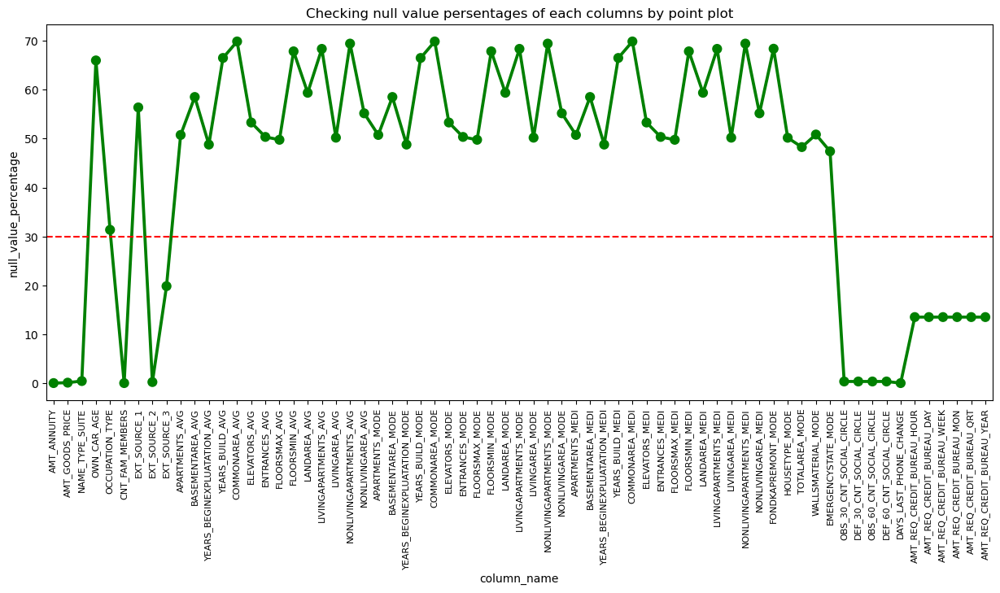

# Default-Rate-Assessment-System
This repository contains an analysis of bank loan default using machine learning techniques. The goal of this project is to build a predictive model that can accurately classify whether a borrower is likely to default on a loan based on various features.

### Business Understanding:

As an employee of a consumer finance company specializing in lending various types of loans to urban customers, Our task is to perform Exploratory Data Analysis (EDA) to identify patterns in the data. The purpose of this analysis is to ensure that the company can make informed decisions regarding loan approvals, minimizing the risk of approving loans to applicants who are unlikely to repay.

_When the company receives a loan application, it faces two types of risks in its decision-making process:_

+ Risk of Not Approving a Loan to a Creditworthy Applicant:
If an applicant is likely to repay the loan, rejecting their application would result in a loss of business for the company. Hence, it is important to identify such creditworthy applicants and approve their loans.

+ Risk of Approving a Loan to an Applicant Who is Likely to Default:
On the other hand, if an applicant is not likely to repay the loan, approving their application may lead to a financial loss for the company. It is crucial to minimize the risk of default by identifying applicants who are likely to repay.

_The following data provides information regarding the loan application at the time of submission._

## Dataset
The analysis is performed on a publicly available dataset obtained from  Bank. The dataset contains information about loan applicants, including their demographic data, financial history, and loan application details. The dataset is stored in the file `loan_applicants_details.csv`, which can be found in the [`data`](data) directory.

## Requirements
To run the analysis, you need the following dependencies:

+ Python 3.7 or higher
+ Jupyter Notebook or JupyterLab
+ Required Python libraries: pandas, numpy, matplotlib, seaborn, scikit-learn

## Analysis Steps

**1. Data Preprocessing:** The dataset is explored and cleaned to handle missing values, outliers, and any inconsistencies. Feature engineering techniques are applied to extract relevant information from the available features.

**2. Exploratory Data Analysis (EDA):** Various visualizations and statistical analyses are performed to gain insights into the dataset. The relationships between different features and the target variable (default or non-default) are explored to identify any patterns or trends.

**3. Feature Selection:** Statistical tests, correlation analysis, and domain knowledge are used to select the most relevant features for training the predictive model. Feature importance is determined using techniques such as feature ranking or feature importance scores.

**4. Model Development:** Several machine learning models are trained using the preprocessed dataset. Different algorithms such as logistic regression, decision   trees, random forests, and gradient boosting are implemented to compare their performance. Cross-validation techniques are employed to evaluate the models and    select the best performing one.

**5. Model Evaluation:** The selected model is evaluated using various evaluation metrics such as accuracy, precision, recall, and F1-score. Additionally, a       confusion matrix is generated to analyze the performance in terms of true positives, false positives, true negatives, and false negatives.

**6. Model Deployment:** Once the best performing model is identified, it is saved and deployed for future use. This can include integrating the model into a web  application or using it for real-time predictions.


## 1. Data Preprocessing:

+ **Python Libraries**

```js
# Necessary Packages

import pandas as pd

# Set Output Display
pd.set_option('display.max_rows', None)
pd.set_option('display.max_columns', None)

import numpy as np

import matplotlib.pyplot as plt
import seaborn as sns
import itertools

# Filter Warnings
import warnings
warnings.filterwarnings('ignore')
```

+ **Data: Reading and Understanding**

```js
# Reading Data from csv file

root = pd.read_csv('loan_applicants_details.csv')
data = root.copy()

columns_info = pd.read_csv('columns_description.csv')
```
All csv files can be found in the [`data`](data) directory

 `Understanding some attributes:-`
 
```js
data['NAME_HOUSING_TYPE'].unique()
```
```js
data['NAME_CONTRACT_TYPE'].unique()
```
```js
data['NAME_EDUCATION_TYPE'].unique()
```
```js
finacial_data = data[['AMT_INCOME_TOTAL' , 'AMT_CREDIT' , 'AMT_ANNUITY']]
finacial_data.describe().T
```
all code can be found in the [main.ipynb](main.ipynb) file.

+ **Checking null value and make dataframe will all attributes with null value (Checking the %)**

```js
null_col = data.isnull().any()
```
```js
null_col_name = data.columns[null_col]
null_col_name
```
```js
len(data[null_col_name].columns)
```
```js
null_data = data[null_col_name]
# Making data frame containing columns with null values and percentage of null values
null_per = pd.DataFrame(null_data.isnull().sum()/len(null_data)*100) . reset_index()
null_per.columns = ['column_name','null_value_percentage']
null_per
```

+ **Visualizing Null Value Percentage with a Point Plot**
```js

plt.figure(figsize = (15,6))


plot = sns.pointplot(x = 'column_name' , y = 'null_value_percentage' , data = null_per , color = 'green')
plt.title('Checking null value persentages of each columns by point plot')

plt.xticks(rotation = 90 , fontsize = 8)

plot.axhline(30 , ls='--' , color = 'red')

plt.show()
```



 `Removing the attributes where more than 30% null values`

```js
null_per_30 = null_per[null_per['null_value_percentage'] >= 30]
rm_col = null_per_30['column_name']
data = data.drop(rm_col , axis = 1)
```
  
+ **Heat map to check the relation with target variable**

```js
#  EXT_SOURCE

EXT_SOURCE_col_name = ['EXT_SOURCE_2','EXT_SOURCE_3']

exs_df = data[EXT_SOURCE_col_name + ['TARGET']]
   
# Heat map
plt.figure(figsize = (8,6))
sns.heatmap(exs_df.corr(),annot = True,cmap ="RdYlGn")
plt.show()
```


`From the above map 'there is no relation between EXT_SOURCE_2,EXT_SOURCE_3 and TARGET' so, we can remove them`
```js
data = data.drop(EXT_SOURCE_col_name , axis = 1)
```

+ **Verifying the number of applicants to determine if they have submitted the necessary documents or not with Count Plot**
```js
# FLAG_DOCUMENTS
flag_Doc_col_name = [ 'FLAG_DOCUMENT_2', 'FLAG_DOCUMENT_3','FLAG_DOCUMENT_4', 'FLAG_DOCUMENT_5', 
                     'FLAG_DOCUMENT_6','FLAG_DOCUMENT_7', 'FLAG_DOCUMENT_8', 'FLAG_DOCUMENT_9',
                     'FLAG_DOCUMENT_10', 'FLAG_DOCUMENT_11', 'FLAG_DOCUMENT_12','FLAG_DOCUMENT_13',
                     'FLAG_DOCUMENT_14', 'FLAG_DOCUMENT_15','FLAG_DOCUMENT_16', 'FLAG_DOCUMENT_17', 
                     'FLAG_DOCUMENT_18','FLAG_DOCUMENT_19', 'FLAG_DOCUMENT_20', 'FLAG_DOCUMENT_21']

doc_df = data[flag_Doc_col_name + ['TARGET']]

doc_df["TARGET"] = doc_df["TARGET"].replace({1:"Defaulter",0:"Repayer"})

# Count Plot

fig = plt.figure(figsize=(20,15))

for i,j in itertools.zip_longest(flag_Doc_col_name,range(len(flag_Doc_col_name))):
    plt.subplot(4,5,j+1)
    ax = sns.countplot(x=doc_df[i],hue=doc_df["TARGET"],palette=["r","g"])
    plt.yticks(fontsize=8)
    plt.xlabel("")
    plt.ylabel("")
    plt.title(i)
```

`We can remove the columns as approx all applicants did non submited any documents`
```js
data = data.drop(flag_Doc_col_name , axis = 1)
```

+ **Again visualize the relationship between some attributes and target variable using a heatmap**
```js
  unnes_col_name = ['FLAG_MOBIL', 'FLAG_EMP_PHONE', 'FLAG_WORK_PHONE', 'FLAG_CONT_MOBILE',
                  'FLAG_PHONE', 'FLAG_EMAIL', 'WEEKDAY_APPR_PROCESS_START', 'HOUR_APPR_PROCESS_START',
                  'OBS_30_CNT_SOCIAL_CIRCLE', 'DEF_30_CNT_SOCIAL_CIRCLE', 'OBS_60_CNT_SOCIAL_CIRCLE',
                  'DEF_60_CNT_SOCIAL_CIRCLE']
unnes_df = data[unnes_col_name + ['TARGET']]

plt.figure(figsize = (20,8))
sns.heatmap(unnes_df.corr(),annot = True,cmap ="RdYlGn")
plt.show()
```

`As there is no relation we can remove them`
```js
data = data.drop(unnes_col_name , axis = 1)
```
+ **Converting negative(-ve) values days to positive(+ve) in some attributes**
  
```js
days_col_name = ['DAYS_BIRTH','DAYS_EMPLOYED','DAYS_REGISTRATION','DAYS_ID_PUBLISH','DAYS_LAST_PHONE_CHANGE']

for col in days_col_name:
    data[col] = abs(data[col])
```
+ **Converting some numerical valued columns to catetory**
```js
# AMT_INCOME_TOTAL
data['AMT_INCOME_TOTAL'].head()
index = [0,1,2,3,4,5,6,7,8,9,10,11]
cata = ['0-100k','100K-200k', '200k-300k','300k-400k',
        '400k-500k','500k-600k','600k-700k','700k-800k',
        '800k-900k','900k-1M', '1M Above']
data['AMT_INCOME_TOTAL'] = data['AMT_INCOME_TOTAL']/100000

data['AMT_INCOME_RANGE']=pd.cut(data['AMT_INCOME_TOTAL'],index,labels=cata)

# AMT_CREDIT
data['AMT_CREDIT']=data['AMT_CREDIT']/100000

index = [0,1,2,3,4,5,6,7,8,9,10,100]
cata = ['0-100K','100K-200K', '200k-300k','300k-400k','400k-500k','500k-600k','600k-700k','700k-800k',
       '800k-900k','900k-1M', '1M Above']

data['AMT_CREDIT_RANGE']=pd.cut(data['AMT_CREDIT'],bins=index,labels=cata)

# DAYS_BIRTH
data['DAYS_BIRTH'] = round(data['DAYS_BIRTH']/365)

data['DAYS_BIRTH'].head()
index = [0,20,30,40,50,100]
cata = ['0-20','20-30','30-40','40-50','50 above']
data['AGE_GROUP']=pd.cut(data['DAYS_BIRTH'],index,labels=cata)

# Creating catagories for YEARS_EMPLOYED

data['DAYS_EMPLOYED'] = data['DAYS_EMPLOYED'] / 365
index = [0,5,10,20,30,40,50,60]
cata = ['0-5','5-10','10-20','20-30','30-40','40-50','50 above']

data['YEARS_EMPLOYED']=pd.cut(data['DAYS_EMPLOYED'],index,labels=cata)
```

+ **Converting some object and numerical data_type to category data_type**

```js
  #Convert Object and Numerical columns to Categorical Columns
cate_col_name = ['NAME_CONTRACT_TYPE','CODE_GENDER','NAME_TYPE_SUITE','NAME_INCOME_TYPE',
                 'NAME_EDUCATION_TYPE','NAME_FAMILY_STATUS','NAME_HOUSING_TYPE','ORGANIZATION_TYPE',
                 'FLAG_OWN_CAR','FLAG_OWN_REALTY','LIVE_CITY_NOT_WORK_CITY','REG_CITY_NOT_LIVE_CITY',
                 'REG_CITY_NOT_WORK_CITY','REG_REGION_NOT_WORK_REGION','LIVE_REGION_NOT_WORK_REGION',
                 'REGION_RATING_CLIENT','REGION_RATING_CLIENT_W_CITY']

for i in cate_col_name:
    data[i] =pd.Categorical(data[i])
```
+ **Null Value Treatment**

```js
# NAME_TYPE_SUITE
data['NAME_TYPE_SUITE'].describe()
data['NAME_TYPE_SUITE'].fillna(data['NAME_TYPE_SUITE'].mode()[0],inplace=True)

#########
amt = ['AMT_REQ_CREDIT_BUREAU_HOUR', 'AMT_REQ_CREDIT_BUREAU_DAY','AMT_REQ_CREDIT_BUREAU_WEEK','AMT_REQ_CREDIT_BUREAU_MON',
         'AMT_REQ_CREDIT_BUREAU_QRT','AMT_REQ_CREDIT_BUREAU_YEAR']

data[amt].describe().T
for i in amt:
    data[i].fillna(data[i].median(),inplace = True)

# YEARS_EMPLOYED
data['YEARS_EMPLOYED'].describe()
data['YEARS_EMPLOYED'].fillna(data['YEARS_EMPLOYED'].mode()[0],inplace=True)

# Numerical Clumns
numeical = ['AMT_ANNUITY','AMT_GOODS_PRICE','CNT_FAM_MEMBERS']
for i in numeical:
    data[i].fillna(data[i].mean(),inplace = True)

# Categorical Columns
categorical = ['AMT_INCOME_RANGE','DAYS_LAST_PHONE_CHANGE']
for i in categorical:
    data[i].fillna(data[i].mode()[0],inplace = True)

# Funal Check of Null Value
data.isnull().any()
```
+ **Identifying Outlayers**

```js
plt.figure(figsize=(22, 16))

outlier_col = ['AMT_ANNUITY', 'AMT_INCOME_TOTAL', 'AMT_CREDIT', 'AMT_GOODS_PRICE',
               'DAYS_EMPLOYED', 'CNT_CHILDREN', 'DAYS_BIRTH']

for i, j in itertools.zip_longest(outlier_col, range(len(outlier_col))):
    plt.subplot(2, 4, j + 1)
    sns.boxplot(y=data[i])
    plt.title(i)
    plt.ylabel("")

plt.tight_layout()
plt.show()


```
`Based on the current application data, it is evident that there are outliers present in the variables AMT_ANNUITY, AMT_CREDIT, AMT_GOODS_PRICE, and CNT_CHILDREN. Additionally, there is a significant number of outliers in the variable AMT_INCOME_TOTAL, indicating that some loan applicants have considerably higher incomes compared to others.`

`Fortunately, the variable DAYS_BIRTH does not contain any outliers, indicating that the available data for this variable is reliable.`

`However, the variable DAYS_EMPLOYED does exhibit outlier values around 350,000 days, which is equivalent to approximately 958 years. Such entries are clearly incorrect and must be erroneous.`

+ **Data Imbalancing**

```js
imbalance = data["TARGET"].value_counts().reset_index()
# Bar Plot
plt.figure(figsize=(8, 6))
x = ['Repayer','Defaulter']
y = imbalance["TARGET"]
sns.barplot(x=x, y=y, palette=['y', 'cyan'])
plt.xlabel("Loan Repayment Status")
plt.ylabel("Count of Repayers & Defaulters")
plt.title("Imbalance Plotting")
plt.show()

# Pie PLot
plt.figure(figsize = (8,8))
plt.pie(y , labels = x , autopct='%1.1f%%')
plt.title("Imbalance Persentages with pie plot")
plt.show()
```


`Ratios of imbalance in percentage with respect to Repayer and Defaulter datas are: 91.9 and 8.1`

## 2. Exploratory Data Analysis (EDA):

+ **Creating function for plots to check the counts of Repayer and Defaulter , and Percentages of Defaulters among all catagories of the attribute**

```js


def ana_plot(col_name):
    fig, (ax1, ax2) = plt.subplots(ncols=2, figsize=(15, 6), facecolor = 'lightgray')
    ax1.set_facecolor(color="#FAF0E4")
    ax2.set_facecolor(color="#ECF8F9")
    
    
    df = data[[col_name,'TARGET']]
    
    def_df = df[df['TARGET']==1]
    def_df_vc = def_df[col_name].value_counts(sort = False).reset_index()
    def_df_vc.columns = [col_name,'Value']
    
    
    sns.countplot(ax = ax1 ,x=col_name,data=df,hue="TARGET" , palette = ['Indigo','Maroon'])
    ax1.legend(['Repayer', 'Defaulter'])
    ax1.set_title('Counts of Repayer and Defaulter of : '+ col_name , color = '#2D033B')
    ax1.set_xticklabels(ax1.get_xticklabels(), rotation=90)
    

    plt.pie(def_df_vc['Value'] , labels=def_df_vc[col_name], autopct='%1.0f%%',rotatelabels = True,
            wedgeprops={'linewidth': 0.7, 'edgecolor': 'white'})
    ax2.set_title('Defaulter % of : '+col_name , color = '#D21312')

    plt.show()
```


+ **CODE_GENDER**
```js
ana_plot('CODE_GENDER')
```

`We can see from the graph Female takes more loans and also they have higher percentages of default rate than Men.`

+ **AGE_GROUP**
```js
ana_plot('AGE_GROUP')
```

`Between age 0 to 20 takes no loan, The highest amount of default rate are made by the age group 30-40, 
The age group above 50 have very less default rate that is 23%, 
Wecan clearly see that approx 67% of default are comes from age between 20-50.`


+ **YEARS_EMPLOYED**
```js
ana_plot('YEARS_EMPLOYED')
```

`We can say that there is a decreasing order of taking loans with increasing years of job experience.`
`And 0 to 5 years of experience have higher default rate that is 70%`


+ **NAME_EDUCATION_TYPE**
```js
ana_plot('NAME_EDUCATION_TYPE')
```

`Persons under Secondary or secondary special takes more loas and have highest default rate i.e 79%`


+ **FLAG_OWN_REALTY**
```js
ana_plot('FLAG_OWN_REALTY')
```


+ **NAME_FAMILY_STATUS**
```js
ana_plot('NAME_FAMILY_STATUS')
```

`Married persons takes more loan and have highest default rate of 60%`


+ **Creating function for plots to check the counts of Repayer and Defaulter , and Percentages of Defaulters among all numerical attribute**

```js
def num_plot(col_name):
    
    df = data[[col_name,'TARGET']]
    
    def_df = df[df['TARGET']==1]
    rep_df = df[df['TARGET']==0]
    
    
    sns.distplot(def_df[col_name], hist=False, color='r',label ="Defaulter")
    sns.distplot(rep_df[col_name], hist=False, color='g', label ="Repayer")
    plt.show()
```

+ **AMT_INCOME_TOTAL**
```js
num_plot('AMT_INCOME_TOTAL')
```


+ **AMT_CREDIT**
```js
num_plot('AMT_CREDIT')
```


+ **AMT_GOODS_PRICE**
```js
num_plot('AMT_GOODS_PRICE')
```


### INSIGHTS

1. When the credit amount exceeds 3 million, there is an observed increase in the number of defaulters.

2. Individuals obtaining loans in the range of 300,000 to 600,000 tend to have a higher default rate 
   compared to other credit ranges, suggesting the need for higher interest rates specifically for this credit range.

3. Since the majority (90%) of loan applicants have a total income of less than 300,000, 
   and they exhibit a higher likelihood of defaulting, offering loans to this income category with higher interest rates
   could be considered.

### SAFER SIDE

1. NAME_EDUCATION_TYPE: Individuals with higher academic degrees exhibit a lower default rate.

2. NAME_INCOME_TYPE: Students and businessmen demonstrate a negligible default rate.

3. REGION_RATING_CLIENT: Clients residing in regions with a RATING 1 are associated with a higher level of safety in terms of      loan defaults.

4. ORGANIZATION_TYPE: Clients engaged in Trade Type 4 and 5 and Industry Type 8 have a default rate of less than 3%.

5. AGE_GROUP: Individuals above the age of 50 are less likely to default on their loans.

6. YEARS_EMPLOYED: Clients with 40+ years of work experience exhibit a default rate of less than 1%.

7. CNT_CHILDREN: Individuals with zero to two children tend to have a higher repayment rate for loans.


### DEFAULTERS

1. CODE_GENDER: Women tend to have a relatively higher default rate.

2. NAME_FAMILY_STATUS: Individuals who are married, in a civil partnership, or single have a higher likelihood of defaulting.

3. NAME_EDUCATION_TYPE: Individuals with a secondary or secondary special education background are more prone to defaulting.

4. NAME_INCOME_TYPE: Clients who are workers or commercial associates have a higher default rate.

5. REGION_RATING_CLIENT: People residing in regions with a rating of 2 exhibit the highest default rates.

6. ORGANIZATION_TYPE: Business entity type 3 and self-employed individuals have the highest percentage of loans not repaid.

7. AGE_GROUP: It is advisable to be cautious with young individuals in the age group of 20-40 as they have a higher probability of defaulting.

8. YEARS_EMPLOYED: Individuals with less than 5 years of employment experience are more likely to default on their loans.


